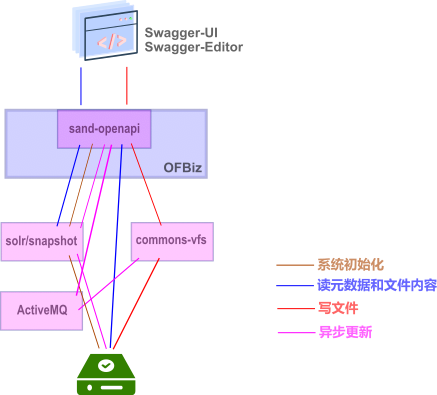

# sand-openapi
本模块是一个OFBiz plugin，通过整合swagger-ui和swagger-editor，为Sandflower提供openapi文档编写环境。
尤其适合的三三制开发：一人编写openapi文档和测试，一人开发Vue3前端代码，一人开发OFBiz后端代码。当然，也可以一个人搞定所有事情。

本模块的功能包括：
1. openapi文档浏览：用户在浏览器中浏览存储在服务器端的openapi文档；
2. openapi文档编辑：用户在浏览器中编辑存储在服务器端的openapi文档；
3. openapi文档版本管理：用户在浏览器中查看、比较和恢复历史版本；
4. 根据openapi文档生成前端代码：用户在浏览器中编辑openapi文档，并生成前端代码；
5. 根据openapi文档生成后端代码：用户在浏览器中编辑openapi文档，并生成后端代码。

### 历史记录实现

本模块历史记录功能，基于Intellij IDEA的开源代码实现，架构图如下：

 

### 开发笔记
1. [sand-openapi开发环境搭建笔记](./docs/zh/envsetup.md)
2. [前端：基于vue3 elment-plus的openapi文档编写环境搭建笔记](./docs/zh/openapi-elementplus-dev.md)
3. [运行apache cxf jax_rs_description_openapi_v3_web样例](./docs/zh/tomcat-cxf-openapi.md)
4. [认证](./docs/zh/auth.md)

### 参考资料
1. [Intellij VFS说明](https://plugins.jetbrains.com/docs/intellij/virtual-file-system.html)
2. [Intellij community源码](https://github.com/JetBrains/intellij-community)
3. [JetBrains maven库](https://packages.jetbrains.team/maven/p/ij/intellij-dependencies/)
