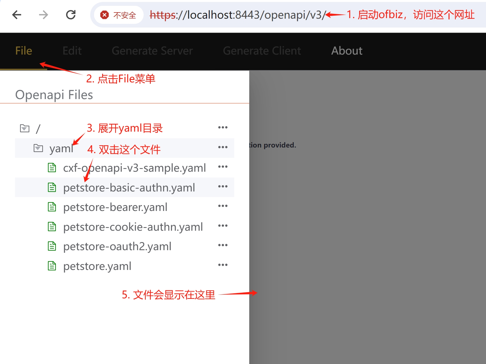
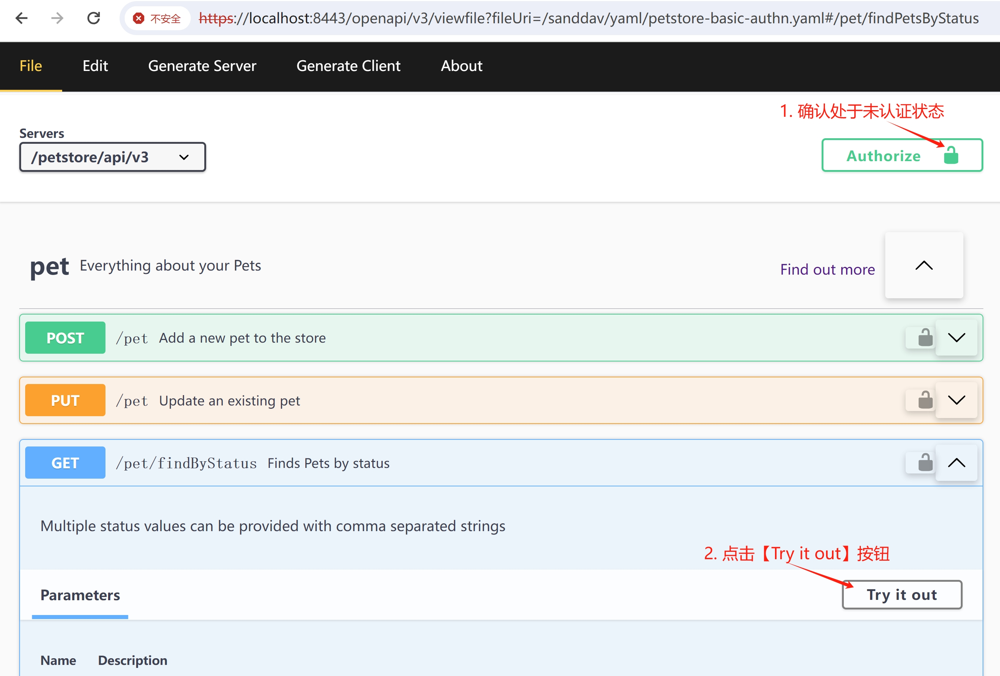
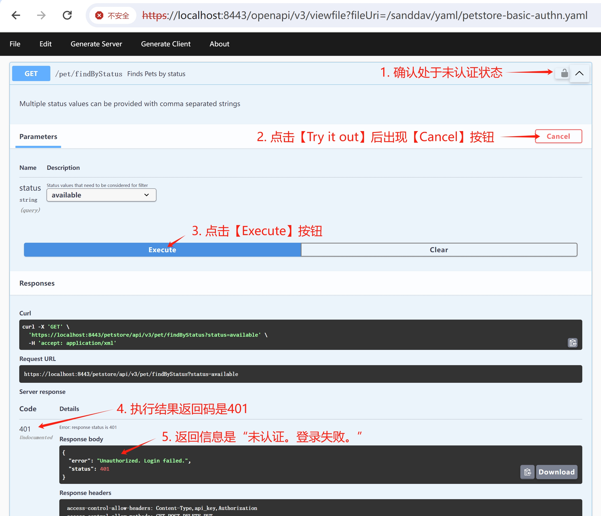
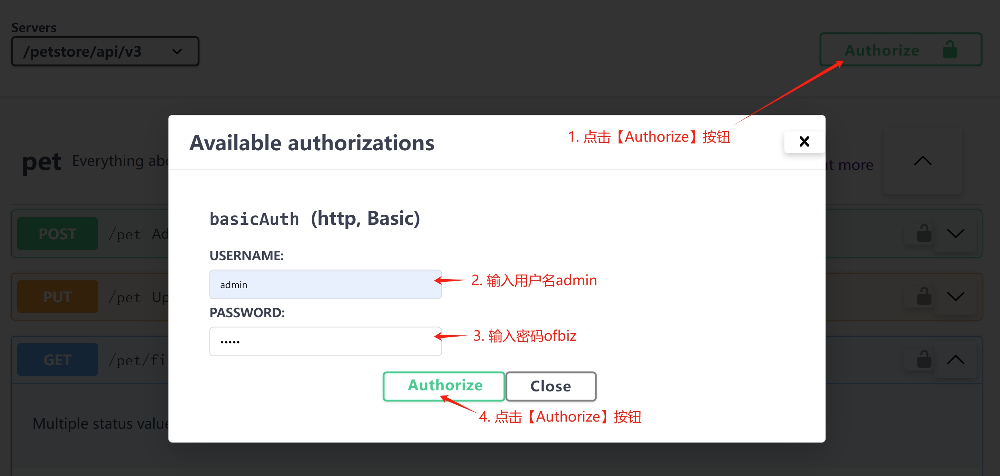
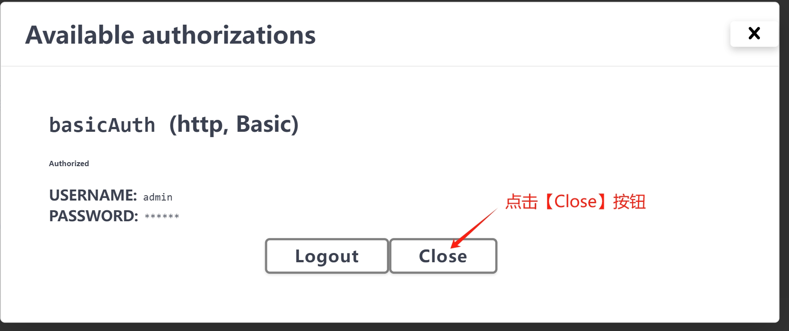
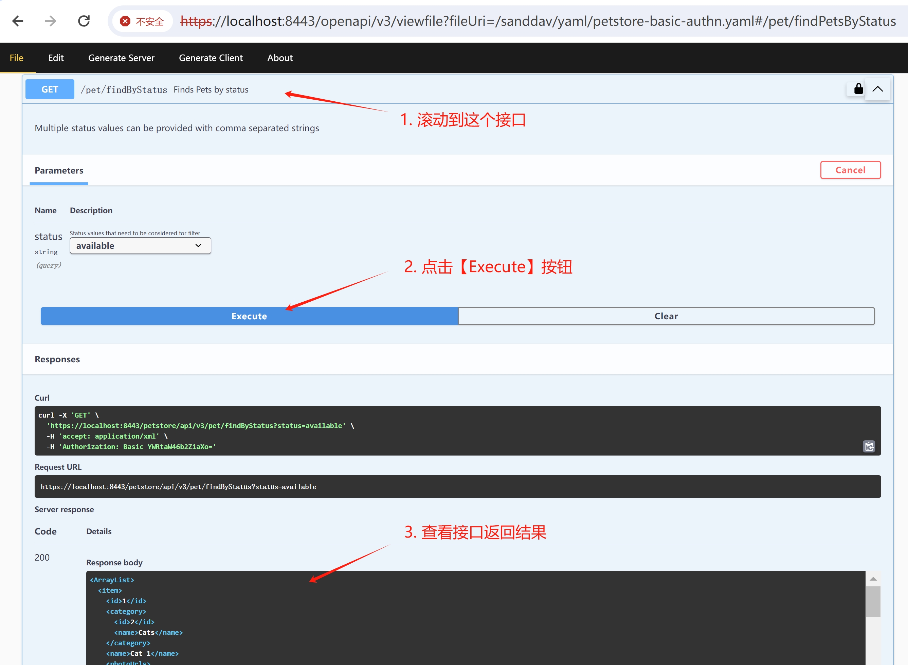

# 实现Http基本认证

Http基本认证，对应OpenAPI文档中的[Basic Authentication](https://swagger.io/docs/specification/authentication/basic-authentication/)。

### 定义Basic认证

yaml/petstore-basic-authn.yaml中定义了Basic认证，如下所示：

```yaml
  securitySchemes:
    basicAuth:
      type: http
      scheme: basic
```

### 操作步骤

1. 选择浏览petstore-basic-authn.yaml，如下图所示：

  

2. 没有登录的情况下，无法访问/pet/findByStatus，如下图所示：

  

  

3. 点击【Authorize】按钮，弹出登录浮窗，如下图所示：

  

**注意：** 此时，前端页面并没有把用户名和密码发送到后端进行用户认证。

4. 点击【Close】按钮，关闭登录浮窗，如下图所示：

  

5. 点击/pet/findByStatus下的【Try it out】按钮，点击【Execute】按钮，查看服务器端的返回结果，如下图所示：

  

6. 点击【Authorize】按钮，弹出登录浮窗，点击【Logout】按钮，退出登录。

### 参考文档
1. [Basic Authentication](https://swagger.io/docs/specification/authentication/basic-authentication/)
2. [Http Bearer认证](bearer-authn.md)
3. [Cookie认证](cookie-authn.md)
4. [OAuth 2.0认证](oauth2.md)