# 实现Http Bearer认证

Http Bearer认证，对应OpenAPI文档中的[Bearer Authentication](https://swagger.io/docs/specification/authentication/bearer-authentication/)。

本模块的bearer，既可以是OFBiz自带的JWT，也可以是通过OFBiz-CAS模块得到的OAuth2 accessToken。

### 定义Bearer认证

yaml/petstore-bearer.yaml中定义了两个Bearer认证，ofbiz_jwt和access_token：

```yaml
  securitySchemes:
    ofbiz_jwt:
      type: http
      scheme: bearer
      bearerFormat: JWT

    access_token:
      type: http
      scheme: bearer
```

### ofbiz_jwt

1. 要使用OFBiz JWT，需要将实体SystemProperty中的`security.internal.sso.enabled`设置为`true`，如下图所示：

  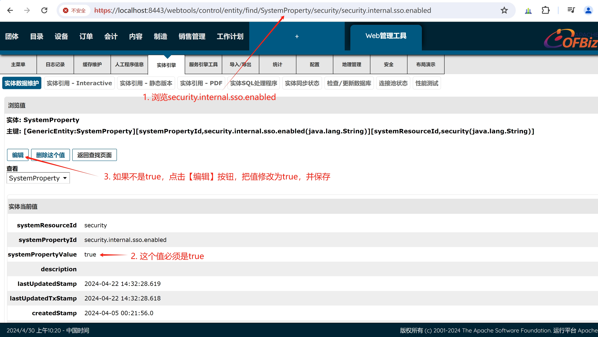

2. 选择浏览petstore-bearer.yaml，如下图所示：

  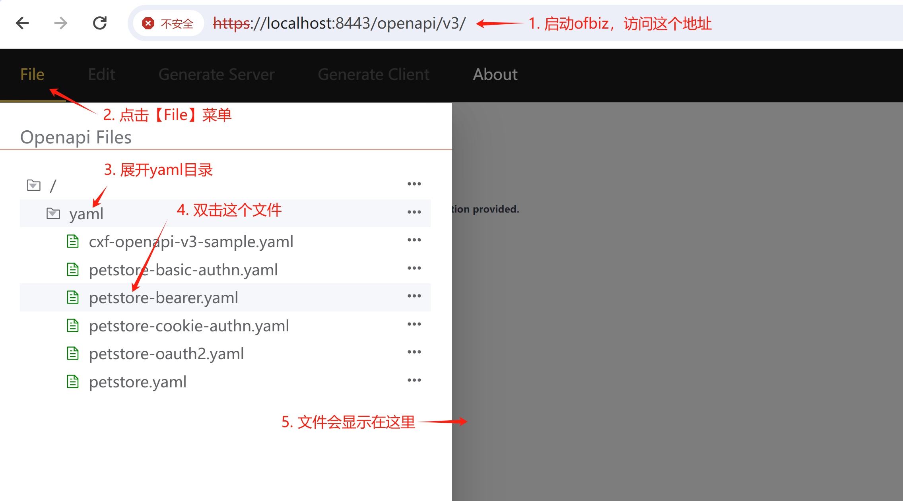

3. 没有登录的情况下，无法访问/pet/findByStatus，如下图所示：

  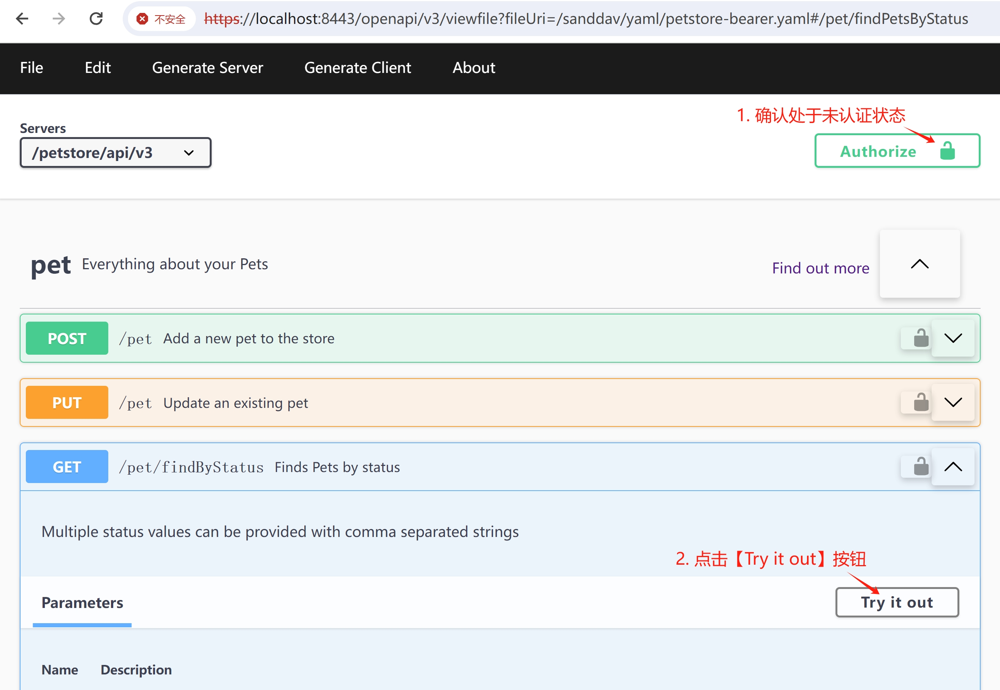

  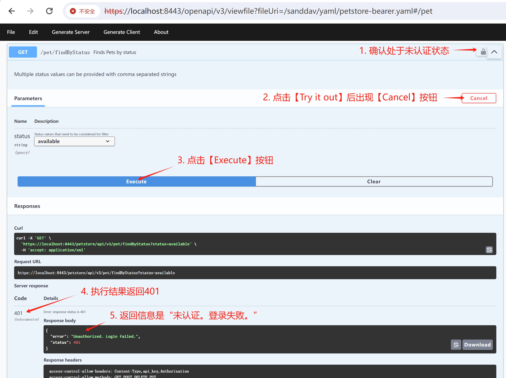

4. 通过访问[https://localhost:8443/webtools/control/loadJWT](https://localhost:8443/webtools/control/loadJWT)获得OFBiz JWT token，步骤如下图所示：

  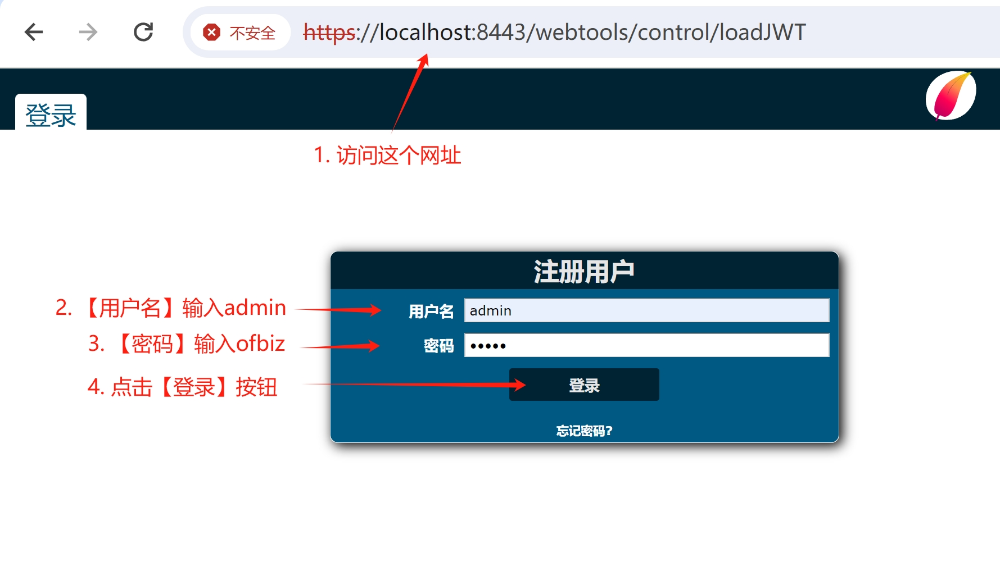

  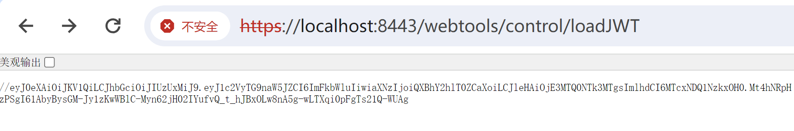

  上图中，//后面的是OFBiz JWT token，复制下来，在下一步认证时使用。

5. 点击【Authorize】按钮，弹出登录浮窗，如下图所示：

  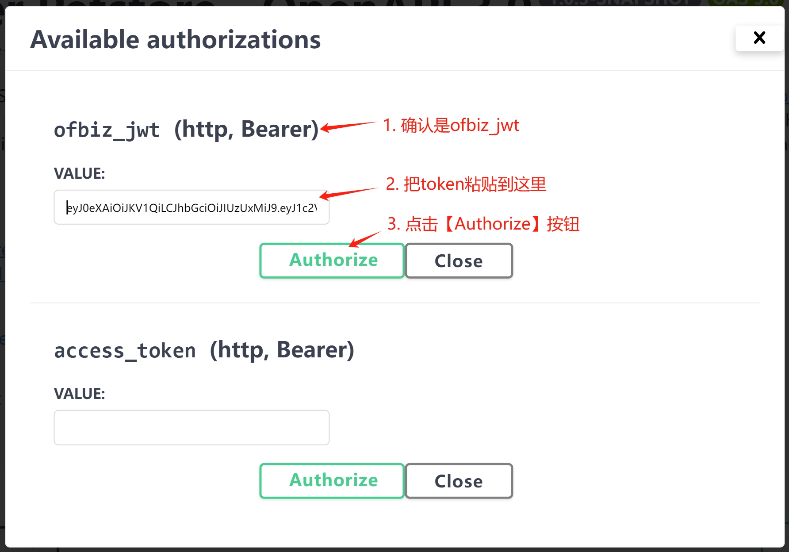

**注意：** 此时，前端页面并没有把token发送到后端进行用户认证。

6. 点击【Close】按钮，关闭登录浮窗，如下图所示：

  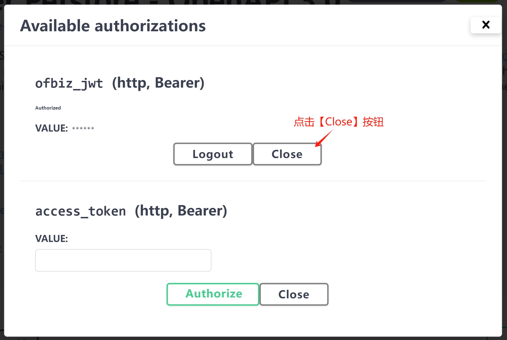

7. 点击/pet/findByStatus下的【Try it out】按钮，点击【Execute】按钮，查看服务器端的返回结果，如下图所示：

  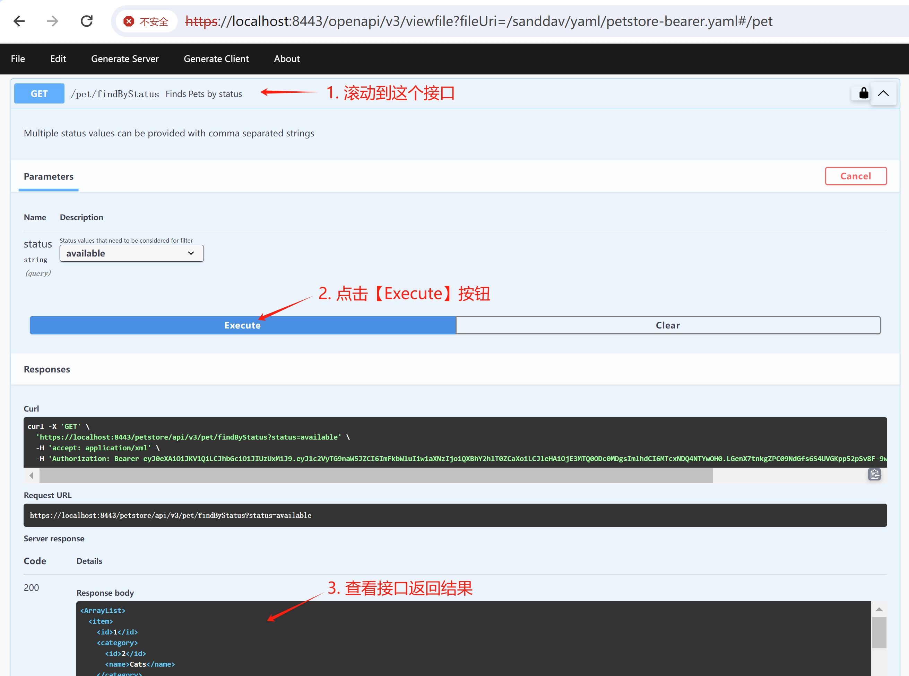

8. 点击【Authorize】按钮，弹出登录浮窗，点击【Logout】按钮，退出登录。

**说明：** Logout时，OFBiz JWT token会被注销掉，不能重复使用。

<br>

### access_token

1. 选择浏览petstore-bearer.yaml，如下图所示：

  

2. 没有登录的情况下，无法访问/pet/findByStatus，如下图所示：

  

  

3. 通过访问[https://localhost:8443/oauth/v2/accessToken?grant_type=password&client_id=SandFlower&username=admin&password=ofbiz](https://localhost:8443/oauth/v2/accessToken?grant_type=password&client_id=SandFlower&username=admin&password=ofbiz)获得OFBiz CAS模块生成的access token，如下图所示：

  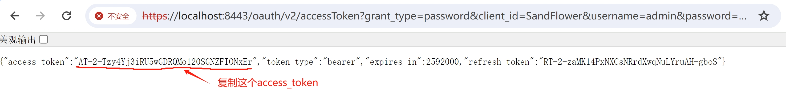

按上图中提示，把OFBiz CAS access_token复制下来，在下一步认证时使用。

5. 点击【Authorize】按钮，弹出登录浮窗，如下图所示：

  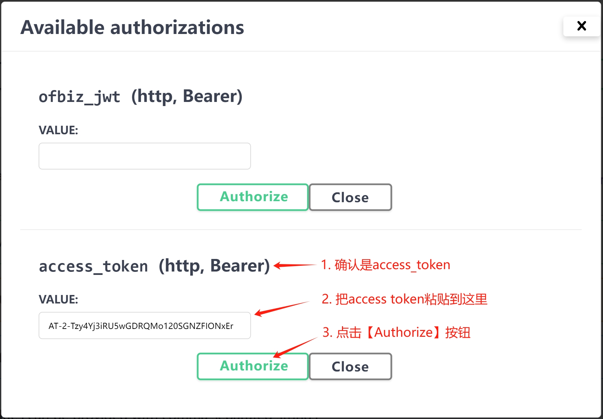

**注意：** 此时，前端页面并没有把access token发送到后端进行用户认证。

6. 点击【Close】按钮，关闭登录浮窗，如下图所示：

  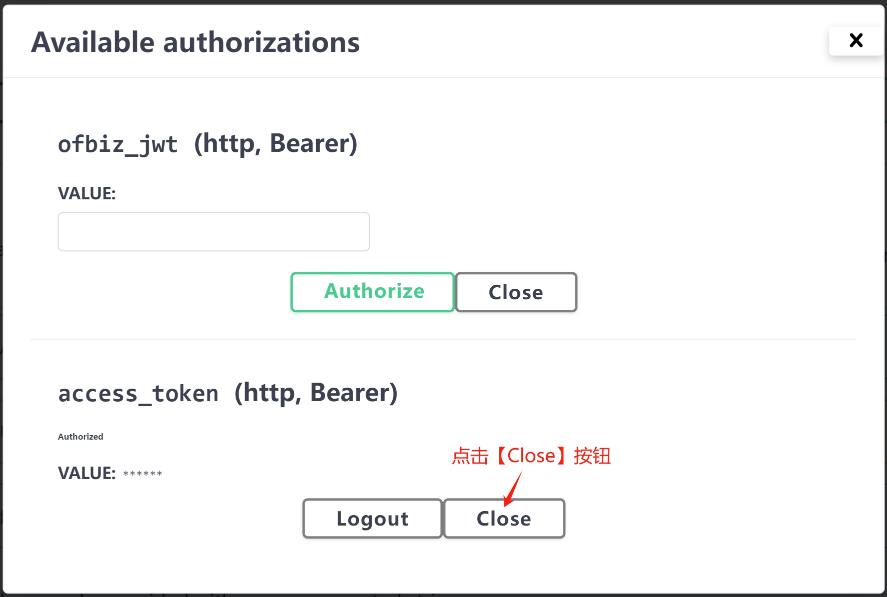

7. 点击/pet/findByStatus下的【Try it out】按钮，点击【Execute】按钮，查看服务器端的返回结果，如下图所示：

  

8. 点击【Authorize】按钮，弹出登录浮窗，点击【Logout】按钮，退出登录。

**说明：** Logout时，OFBiz CAS access token不会被注销掉，可以重复登录使用。

<br>

### 参考资料
1. [OpenAPI - Bearer Authentication](https://swagger.io/docs/specification/)
2. [Http基本认证](basic-authn.md)
3. [OAuth 2.0认证](oauth2.md)
