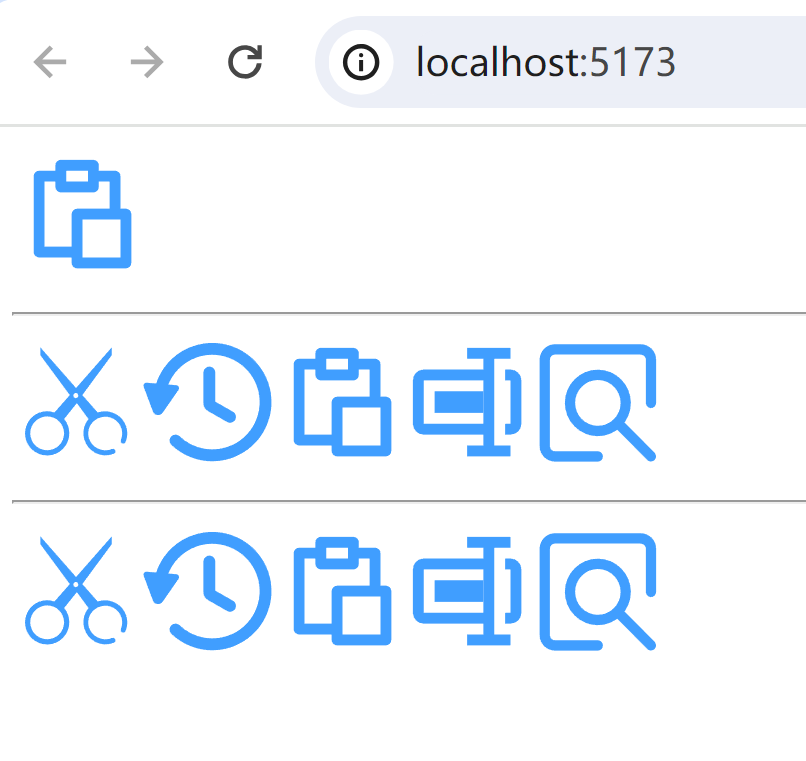

## 扩展@element-plus/icon-vue图标
@element-plus/icon-vue中，对于WebDav文件操作，缺少剪切等图标，因此需要进行扩展。

目前扩展了五个图标，如下图所示：



<br><br>
扩展和部署方法，详见[el-icon-ext](https://github.com/langhua/el-icon-ext)。

简言之，步骤如下：
1. 把el-icon-ext模块的packages/vue/dist到本模块的vuejs/openapi/src/assets/@langhua/el-icon-ext目录下
2. 把@langhua/el-icon-ext模块配置到vuejs/openapi/package.json中:
    ```json
      ...
      "dependencies": {
        ...
        "@langhua/el-icon-ext": "link:./src/assets/@langhua/el-icon-ext"
      },
      ...
    ```
3. 通过yarn安装模块，yarn支持link @langhua/el-icon-ext到本地的用法:
   ```shell
   yarn install
   ```
4. 运行openapi:

   ```shell
   yarn dev
   or
   npm run dev
   ```
