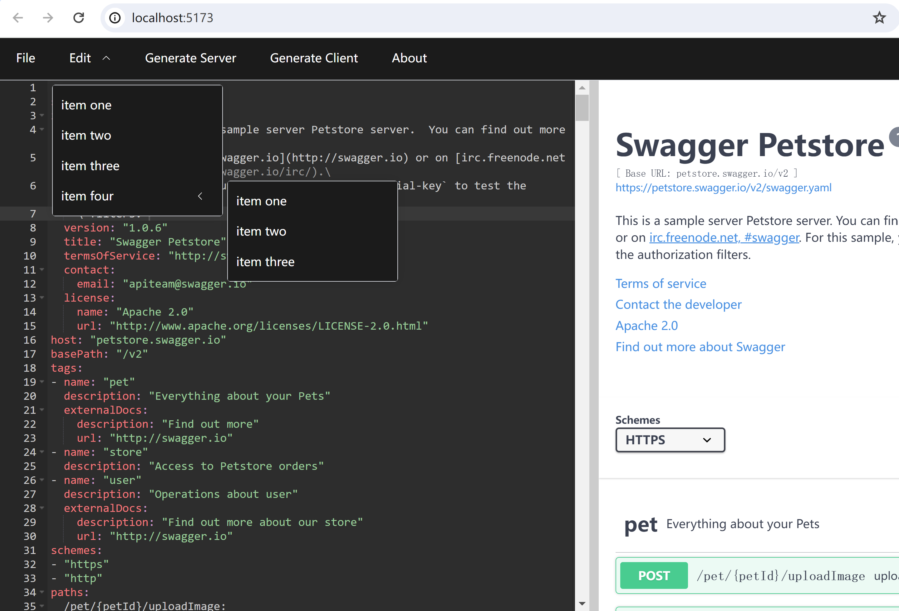

## 基于el-menu实现菜单功能

### 安装element-plus
el-menu是element-plus的组件，需要先安装element-plus：

```shell
npm install element-plus --save
```

### 引入el-menu
1. 新建vuejs/openapi/src/components/EditorMenu.vue文件，内容如下：

```vue
<script setup lang="ts">
  import { ref } from 'vue'
  const activeIndex = ref('8')
  const handleFileClick = ($parent: any) => {
    $parent.openFileDrawer()
  }
  const cancelSelection = () => {
    activeIndex.value = activeIndex.value == '8' ? '9' : '8'
  }
  defineExpose ({
    cancelSelection
  })
</script>

<template>
  <el-menu
    :default-active="activeIndex"
    mode="horizontal"
    background-color="#1b1b1b"
    text-color="#fff"
    active-text-color="#ffd04b"
  >
    <el-menu-item index="1" @click="handleFileClick($parent)">File</el-menu-item>
    <el-sub-menu index="2">
      <template #title>Edit</template>
      <el-menu-item index="2-1">item one</el-menu-item>
      <el-menu-item index="2-2">item two</el-menu-item>
      <el-menu-item index="2-3">item three</el-menu-item>
      <el-sub-menu index="2-4">
      <template #title>item four</template>
      <el-menu-item index="2-4-1">item one</el-menu-item>
      <el-menu-item index="2-4-2">item two</el-menu-item>
      <el-menu-item index="2-4-3">item three</el-menu-item>
      </el-sub-menu>
    </el-sub-menu>
    <el-menu-item index="3">Generate Server</el-menu-item>
    <el-menu-item index="4">Generate Client</el-menu-item>
    <el-menu-item index="5">About</el-menu-item>
  </el-menu>
</template>

<style scoped>
.el-menu--horizontal {
  height: 50px;
}
</style>
```

说明：经过试验，通过改变activeIndex.value可以取消菜单项的选中。

2. 编辑vuejs/openapi/src/App.vue，显示菜单：

```vue
<script setup lang="ts">
  // import SwaggerUI from '@/components/SwaggerUI.vue'
  import SwaggerEditor from '@/components/SwaggerEditor.vue'
  import EditorMenu from '@/components/EditorMenu.vue'
</script>

<template>
  <!-- <SwaggerUI /> -->
  <EditorMenu/>
  <SwaggerEditor/>
</template>
```

3. 执行效果，如下图所示：



<br/>

### 参考资料
1. [el-menu菜单控件](https://element-plus.org/zh-CN/component/menu.html)