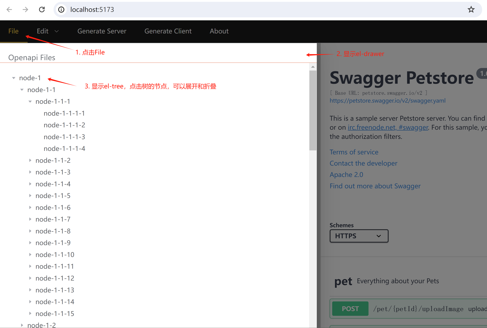
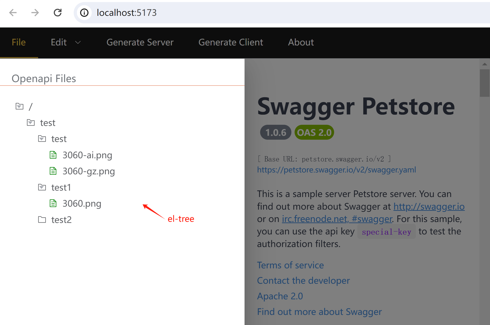

## 基于element-tree实现目录树

### 功能
1. 在侧边栏中显示服务器端的目录树
2. 双击目录树文件节点，在swagger-editor编辑区中打开文件

### 引入element-tree，验证原型
1. 新建vuejs/openapi/src/views/FileTree.vue文件，内容如下：
```vue
<script setup lang="ts">
interface Tree {
  id: string
  label: string
  children?: Tree[]
}

const getKey = (prefix: string, id: number) => {
  return `${prefix}-${id}`
}

const handleNodeClick = (data: Tree) => {
  console.log(data)
}

const createData = (
  maxDeep: number,
  maxChildren: number,
  minNodesNumber: number,
  deep = 1,
  key = 'node'
): Tree[] => {
  let id = 0
  return Array.from({ length: minNodesNumber })
    .fill(deep)
    .map(() => {
      const childrenNumber =
        deep === maxDeep ? 0 : Math.round(Math.random() * maxChildren)
      const nodeKey = getKey(key, ++id)
      return {
        id: nodeKey,
        label: nodeKey,
        children: childrenNumber
          ? createData(maxDeep, maxChildren, childrenNumber, deep + 1, nodeKey)
          : undefined,
      }
    })
}

const props = {
  value: 'id',
  label: 'label',
  children: 'children',
}
const data = createData(4, 30, 40)
</script>

<template>
  <el-tree :data="data" :props="props" @node-click="handleNodeClick" />
</template>
```

通过createData方法生成了模拟数据。

2. 编辑vuejs/openapi/src/App.vue，在el-drawer中显示FileTree，代码如下：

```vue
<script setup lang="ts">
  import { ref } from 'vue'
  // import SwaggerUI from '@/components/SwaggerUI.vue'
  import SwaggerEditor from '@/components/SwaggerEditor.vue'
  import EditorMenu from '@/components/EditorMenu.vue'
  import FileTree from '@/views/FileTree.vue'

  const direction = ref('ltr')
  const fileDrawer = ref(false)
  const editorMenuRef = ref()
  const closeFileDrawer = () => {
    if (editorMenuRef != null && editorMenuRef.value != null) {
      editorMenuRef.value.cancelSelection()
    }
    fileDrawer.value = false
  }
  const openFileDrawer = () => {
    if (fileDrawer != null && fileDrawer.value != null) {
      fileDrawer.value = true
    }
  }

  const openDrawer = () => {
    console.log("--1--")
  }

  defineExpose ({
    openFileDrawer
  })
</script>

<template>
  <!-- <SwaggerUI /> -->
  <EditorMenu ref="editorMenuRef"/>
  <SwaggerEditor/>

  <div>
    <el-drawer
      v-model="fileDrawer"
      title="Openapi Files"
      :direction="direction"
      :before-close="closeFileDrawer"
      style="top: 50px;"
      size="50%"
      :show-close="false"
      @open="openDrawer"
    >
      <template #default>
        <Suspense>
          <FileTree />
        </Suspense>
      </template>
    </el-drawer>
  </div>
</template>

<style scoped>
:deep(.el-drawer__header) {
  margin-bottom: 0px;
  border-bottom: 1px solid darksalmon;
}
</style>
```

3. 运行并访问，点击File菜单，在页面左侧显示带有el-tree的抽屉，如下图所示：



<br/>

### Json数据生成

1. 新建src/main/java/langhua/openapi/webdav/OpenapiWebdavServlet.java

```java
public class OpenapiWebdavServlet extends WebdavServlet {
    ...
}
```

2. 修改OpenapiWebdavServlet，令/runtime/openapi/为webdav根目录：

```java
    public void init() throws ServletException {
        ...
        // reset WebResourceRoot to WEBDAV_ROOT configured
        if (!isMainSet && resources != null && resources instanceof StandardRoot) {
            File file = FileUtil.getFile(WEBDAV_ROOT);
            if (!file.exists()) {
                file.mkdirs();
            }
            WebResourceSet webResourceSet = new DirResourceSet(resources, "/", file.getAbsolutePath(), "/");
            try {
                setMainResourcesMethod.setAccessible(true);
                setMainResourcesMethod.invoke(resources, webResourceSet);
                setMainResourcesMethod.setAccessible(false);
                isMainSet = true;
            } catch (IllegalAccessException | InvocationTargetException e) {
                Debug.logError(e, MODULE);
            }
        }

        jsonSortManager = new JsonSortManager();
    }
```

3. 继续修改OpenapiWebdavServlet，令webdav返回目录树的json格式文件：

```java
    protected InputStream renderJsonTree(String contextPath, WebResource resource)
            throws IOException {
        ...
    }
```

4. 新建webapp/sanddav/WEB-INF/web.xml，使用OpenapiWebdavServlet，内容如下：

```xml
   <?xml version="1.0" encoding="UTF-8"?>
   <web-app xmlns:xsi="http://www.w3.org/2001/XMLSchema-instance"
       xmlns="http://java.sun.com/xml/ns/javaee"
       xsi:schemaLocation="http://java.sun.com/xml/ns/javaee http://java.sun.com/xml/ns/javaee/web-app_3_0.xsd"
       id="sand_openapi_sanddav" version="3.0">
       <display-name>Sand Webdav</display-name>
       ...
       <servlet>
           <servlet-name>webdav</servlet-name>
           <servlet-class>langhua.openapi.webdav.OpenapiWebdavServlet</servlet-class>
           <init-param>
               <param-name>debug</param-name>
               <param-value>0</param-value>
           </init-param>
           <init-param>
               <param-name>listings</param-name>
               <param-value>true</param-value>
           </init-param>
           <!-- Read-Write Access Settings -->
           <init-param>
               <param-name>readonly</param-name>
               <param-value>false</param-value>
           </init-param>
       </servlet>
       <!-- URL Mapping -->
       <servlet-mapping>
           <servlet-name>webdav</servlet-name>
           <url-pattern>/*</url-pattern>
       </servlet-mapping>
       ...
   </web-app>
```

5. 启动OFBiz，在浏览器中访问http://localhost:8080/sanddav/，会返回Json数据，如下所示：

```json
{"resources":[{"name":"/", "type":"Dir", "path":"/sanddav","resources":[{"name":"test","type":"Dir","path":"/sanddav/test/","resources":[{"name":"test","type":"Dir","path":"/sanddav/test/test/","resources":[{"name":"3060-ai.png","type":"File","path":"/sanddav/test/test/3060-ai.png"},{"name":"3060-gz.png","type":"File","path":"/sanddav/test/test/3060-gz.png"}]},{"name":"test1","type":"Dir","path":"/sanddav/test/test1/","resources":[{"name":"3060.png","type":"File","path":"/sanddav/test/test1/3060.png"}]},{"name":"test2","type":"Dir","path":"/sanddav/test/test2/"}]}]}]}
```

可以使用在线Json验证工具来验证Json数据是否正确。

<br/>

### 修改FileTree.vue，使用Json数据
编辑vuejs/openapi/src/views/FileTree.vue文件，内容如下：
```typescript
<script setup lang="ts">
import axios from 'axios'
import { CopyDocument,
         Document, DocumentAdd, DocumentDelete,
         Folder, FolderAdd, FolderDelete, 
         Menu, Refresh } from '@element-plus/icons-vue'

import { Cut, Paste, FileHistory } from '@langhua/el-icon-ext'

const env = import.meta.env
const fileTree = await axios.get(env.VITE_SANDFLOWER_SERVER + env.VITE_SANDFLOWER_SANDDAV_FILETREE)
                            .then(response => {
                                // console.log(JSON.stringify(response.data))
                                return JSON.parse(JSON.stringify(response.data))
                            })

interface FileTree {
  name: string
  type: string
  path: string
  resources?: FileTree[]
}

const fileTreeProps = {
  value: 'path',
  label: 'name',
  children: 'resources',
}

const handleNodeClick = (data: FileTree) => {
  console.log(data)
}
</script>

<template>
  <el-tree 
    :data="fileTree.resources"
    :props="fileTreeProps"
    node-key="path"
    @node-click="handleNodeClick"
    :default-expanded-keys="[fileTree.resources[0].path]"
  >
    <template #default="{ node, data }">
      <span class="custom-tree-node">
        <el-icon v-if="data.type == 'File'" class="file-node-icon" color="green"><Document /></el-icon>
        <el-icon v-else-if="data.type == 'Dir'" class="file-node-icon"><Folder /></el-icon>
        <span class="tree-node-label"> {{ node.label }} </span>
      </span>
    </template>
  </el-tree>
</template>

<style scoped>
.custom-tree-node {
  flex: 1;
  display: flex;
  align-items: center;
  justify-content: space-between;
  font-size: 14px;
  padding-right: 8px;
}

.tree-node-label {
  flex: auto;
  margin-left: 4px;
}

.file-node-icon {
  margin-left: -1.3em;
  margin-right: 4px;
}
</style>
```

实际效果如下图所示：



<br/>

### 参考资料
1. [element-plus树形控件](https://element-plus.org/zh-CN/component/tree.html)