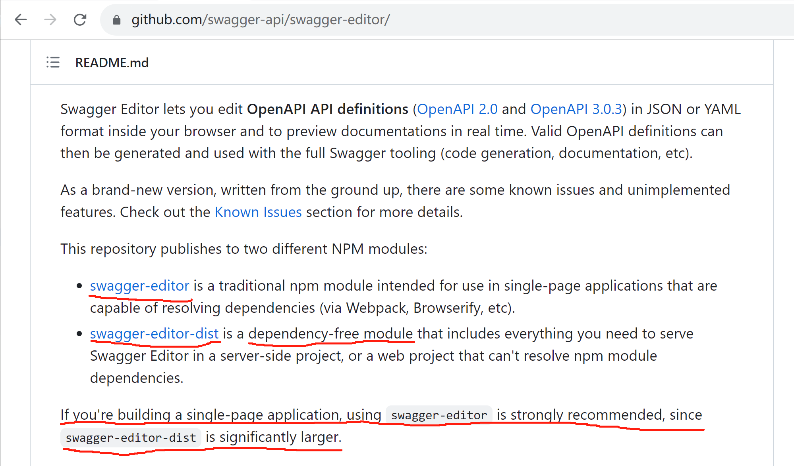
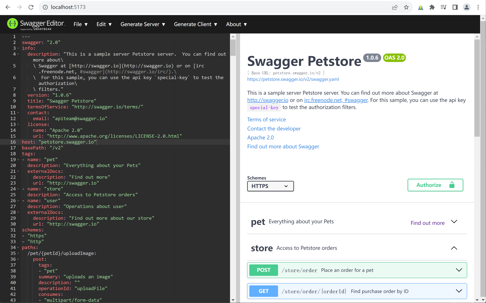
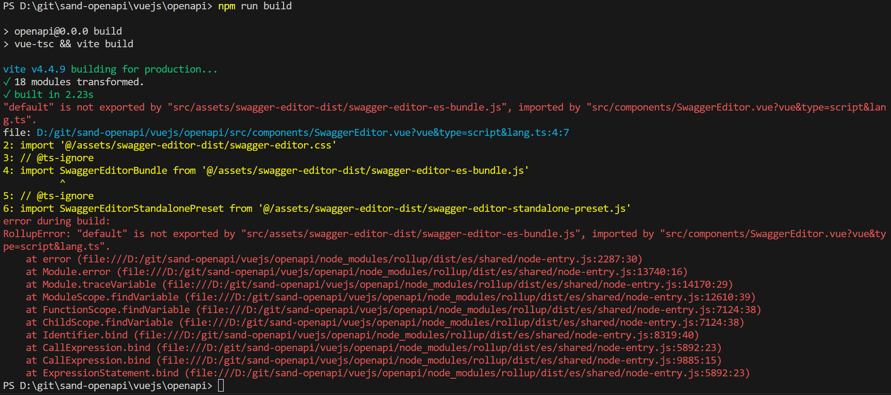

## sand-openapi开发环境搭建笔记

### idea community开发本项目框架
推荐使用idea community来开发sand-openapi模块。步骤如下：
1. 下载和安装idea community
2. 在idea中，从github检出[ofbiz-framework](https://github.com/apache/ofbiz-framework)、[sand-openapi](https://github.com/langhua/sand-openapi)到本地，比如

    1. Windows下：

   ```shell
   D:\git\ofbiz-framework
   D:\git\sand-openapi
   D:\git\ofbiz-plugins
   ```

    2. Linux下：

   ```shell
   ~/git/ofbiz-framework
   ~/git/sand-openapi
   ~/git/ofbiz-plugins
   ```

   说明：[ofbiz-plugins](https://github.com/apache/ofbiz-plugins)选装。


3. 在把sand-openapi目录链接为ofbiz-framework/plugins/sand-openapi
    1. Windows中，以系统管理员身份运行命令行终端：

   ```shell
   C:\Windows\System32>D:
   D:\>cd git\ofbiz-framework
   D:\git\ofbiz-framework>mklink /D plugins ..\ofbiz-plugins
   D:\git\ofbiz-framework>cd plugins
   D:\git\ofbiz-framework\plugins>mklink /D sand-openapi ..\..\sand-openapi
   ```

    2. Linux下：

   ```shell
   ~$cd ~/git/ofbiz-framework
   ~/git/ofbiz-framework$ln -s ../ofbiz-plugins plugins
   ~/git/ofbiz-framework$cd plugins
   ~/git/ofbiz-framework/plugins$ln -s ../../sand-openapi sand-openapi
   ```

<br/><br/>

### VSCode开发vuejs子项目
即在idea的java项目中，套了一个vscode来开发vuejs子项目。步骤如下：

1. 下载并安装[VSCode](https://code.visualstudio.com/download)

2. 在VSCode中，新建vuejs目录，在vuejs目录下，通过vue创建openapi项目：

   ```shell
   cd vuejs
   npm create vue@latest
   ```
   运行结果如下图所示：

   
<br/>

3. 按照上面提示的命令，完成openapi项目初始化，并启动：
   ```shell
   cd openapi
   npm install
   npm run format
   npm run dev
   ```

4. 在浏览器中打开http://localhost:5173/ ，验证页面访问正常。

5. 编辑vuejs/openapi/src/vite.config.js：
   ```javascript
   import { fileURLToPath, URL } from 'node:url'
   
   import { defineConfig } from 'vite'
   import vue from '@vitejs/plugin-vue'
   import vueJsx from '@vitejs/plugin-vue-jsx'
   
   // https://vitejs.dev/config/
   export default defineConfig({
   plugins: [
     vue(),
     vueJsx(),
   ],
   resolve: {
     alias: {
       '@': fileURLToPath(new URL('./src', import.meta.url))
     },
     preserveSymlinks: true
   },
   base: './',
   build: {
     outDir: '../../webapp/openapi/v3',
   },
   envDir: './env'
   })
   ```

6. 上面的文件会报错，安装@vitejs/plugin-vue-jsx和@types/node来消除错误：
   ```shell
   npm install -D @vitejs/plugin-vue-jsx
   npm install -D @types/node
   ```

<br/><br/>

### vite+vue3+swagger-ui
说明：开发和调试vue3代码，是在vscode中，打开vuejs/openapi目录，如下图所示：


<br/>

本小节内容均是在vuejs/openapi目录下进行。

1. 根据[swagger-ui](https://github.com/swagger-api/swagger-ui/)的README.md中的说明（如下图所示），swagger-ui-dist适合单页应用开发，正符合在本模块vue3里调用swagger-ui的设想，所以安装swagger-ui-dist和@types/swagger-ui-dist两个node模块：

   
<br/>

   ```shell
   npm i -D swagger-ui-dist 
   npm i -D @types/swagger-ui-dist
   ```

2. 新建src/components/SwaggerUI.vue，把swagger-ui-dist/index.html转写为vue3：

   node_modules/swagger-ui-dist/index.html:
   ```html
   <!-- HTML for static distribution bundle build -->
   <!DOCTYPE html>
   <html lang="en">
     <head>
       <meta charset="UTF-8">
       <title>Swagger UI</title>
       <link rel="stylesheet" type="text/css" href="./swagger-ui.css" />
       <link rel="stylesheet" type="text/css" href="index.css" />
       <link rel="icon" type="image/png" href="./favicon-32x32.png" sizes="32x32" />
       <link rel="icon" type="image/png" href="./favicon-16x16.png" sizes="16x16" />
     </head>
   
     <body>
       <div id="swagger-ui"></div>
       <script src="./swagger-ui-bundle.js" charset="UTF-8"> </script>
       <script src="./swagger-ui-standalone-preset.js" charset="UTF-8"> </script>
       <script src="./swagger-initializer.js" charset="UTF-8"> </script>
     </body>
   </html>
   ```
   
   src/components/SwaggerUI.vue:
   ```vue
   <template>
       <div id="swagger-ui"></div>
   </template>
   
   <script lang="ts">
   import 'swagger-ui-dist/swagger-ui.css'
   import 'swagger-ui-dist/index.css'
   import { SwaggerUIBundle, SwaggerUIStandalonePreset } from 'swagger-ui-dist'
   
   export default {
       mounted() {
           SwaggerUIBundle({
               // 或者使用yaml样例文件: "https://petstore.swagger.io/v2/swagger.yaml"
               url: "https://petstore.swagger.io/v2/swagger.json",
               dom_id: '#swagger-ui',
               deepLinking: true,
               presets: [
                   SwaggerUIBundle.presets.apis,
                   SwaggerUIStandalonePreset
               ],
               plugins: [
                   SwaggerUIBundle.plugins.DownloadUrl
               ],
               // 如果使用StandaloneLayout，会显示swagger-ui自带的页眉和页脚
               // layout: "StandaloneLayout"
           })
       }
   }
   </script>
   ```

3. 编译到webapp/openapi/v3/目录下：
   1. 配置vite.config.ts：
   ```typescript
   import { fileURLToPath, URL } from 'node:url'
   import { defineConfig } from 'vite'
   import vue from '@vitejs/plugin-vue'
   import vueJsx from '@vitejs/plugin-vue-jsx'

   // https://vitejs.dev/config/
   export default defineConfig({
       plugins: [
           vue(),
           vueJsx()
       ],
       resolve: {
           alias: {
               '@': fileURLToPath(new URL('./src', import.meta.url))
           },
           preserveSymlinks: true
       },
       base: './',
       build: {
           outDir: '../../webapp/openapi/v3',
       },
       envDir: './env',
   })
   ```
   
   2. 执行编译命令：
   ```shell
   npm run build
   ```
   编译命令执行情况如下图所示：

   

   <br>

   3. 根据上图提示，在vite.config.ts中加入chunk配置：
   ```typescript
   ...
   build: {
       outDir: '../../webapp/openapi/v3',
       chunkSizeWarningLimit: 1500, // 文件大小超过1500kb时显示警告提示
       rollupOptions: {
           output: {
               manualChunks(id: any): string {
                   if (id.includes("swagger-ui-dist")) {
                       return "swagger-ui-dist" + id.toString().split("swagger-ui-dist")[1]
                   }
               }
           }
       }
   },
   ...
   ```
   
   4. 再次执行编译命令，结果如下图所示：

   

   <br>

   5. 启动OFBiz，在浏览器中访问：http://localhost:8080/openapi/v3/ ，如下图所示：
   
   

   <br>

   6. 至此，swagger-ui的开发环境搭建完成。

<br>

### vite+vue3+swagger-editor
继续在vuejs/openapi目录下，加入swagger-editor。

1. 根据[swagger-editor](https://github.com/swagger-api/swagger-editor/)的README.md中的说明（如下图所示），swagger-editor-dist适合单页应用开发，正符合在本模块vue3里调用swagger-editor的设想，所以安装swagger-editor-dist这个node模块。很遗憾，没有找到@types/swagger-editor-dist模块。

   

<br/>

   ```shell
   npm i -D swagger-editor-dist 
   ```

<br/>

   【说明】
   这句推荐使用swagger-editor，经过试验，不适用于vue3。所以，使用swagger-editor-dist。
   ```
   If you're building a single-page application, using swagger-editor is strongly recommended, since swagger-editor-dist is significantly larger.
   ```

2. 新建src/views/SwaggerEditor.vue，把swagger-editor-dist的index.html转写为vue3：

   swagger-editor-dist/index.html:
   ```html
   <!DOCTYPE html>
   <!-- HTML for static distribution bundle build -->
   <html lang="en">
      <head>
        <meta charset="UTF-8">
        <title>Swagger Editor</title>
        <style>
          ...
        </style>
        <link href="./swagger-editor.css" rel="stylesheet">
        <link rel="icon" type="image/png" href="./favicon-32x32.png" sizes="32x32" />
        <link rel="icon" type="image/png" href="./favicon-16x16.png" sizes="16x16" />
      </head>
      
      <body>
        <div id="swagger-editor"></div>
        <script src="./swagger-editor-bundle.js"> </script>
        <script src="./swagger-editor-standalone-preset.js"> </script>
        <script>
        window.onload = function() {
          // Build a system
          const editor = SwaggerEditorBundle({
            dom_id: '#swagger-editor',
            layout: 'StandaloneLayout',
            presets: [
              SwaggerEditorStandalonePreset
            ],
            queryConfigEnabled: false,
          })
      
          window.editor = editor
        }
        </script>
      
        <svg xmlns="http://www.w3.org/2000/svg" xmlns:xlink="http://www.w3.org/1999/xlink" style="position:absolute;width:0;height:0">
          <defs>
            ...   
          </defs>
        </svg>
      
      </body>
   
   </html>
   ```
   
   src/components/SwaggerEditor.vue:
   ```typescript
   <template>
     <div id="swagger-editor"></div>
     <svg xmlns="http://www.w3.org/2000/svg" xmlns:xlink="http://www.w3.org/1999/xlink" style="position:absolute;width:0;height:0">
       <defs>
         ...   
       </defs>
     </svg>
   </template>
   
   <script lang="ts">
   import '@/assets/swagger-editor-dist/swagger-editor.css'
   // @ts-ignore
   import SwaggerEditorBundle from '@/assets/swagger-editor-dist/swagger-editor-es-bundle.js'
   // @ts-ignore
   import SwaggerEditorStandalonePreset from '@/assets/swagger-editor-dist/swagger-editor-standalone-preset.js'
   
   export default {
       mounted() {
           SwaggerEditorBundle({
               dom_id: '#swagger-editor',
               layout: 'StandaloneLayout',
               presets: [
                   SwaggerEditorStandalonePreset
               ],
               queryConfigEnabled: false,
           })
       }
   }
   </script>
   
   <style>
     ...   
   </style>
   ```

3. 把node_modules/swagger-editor-dist/链接为src/assets/swagger-editor-dist：

   你可能注意到了SwaggerEditor.vue中，使用了
   ```typescript
   import '@/assets/swagger-editor-dist/swagger-editor.css'
   // @ts-ignore
   import SwaggerEditorBundle from '@/assets/swagger-editor-dist/swagger-editor-es-bundle.js'
   // @ts-ignore
   import SwaggerEditorStandalonePreset from '@/assets/swagger-editor-dist/swagger-editor-standalone-preset.js'
   ```


   1. Windows中，以系统管理员身份运行命令行终端：
   ```shell
   D:\git\sand-openapi\vuejs\openapi\src\>mkdir assets
   D:\git\sand-openapi\vuejs\openapi\src\>cd assets
   D:\git\sand-openapi\vuejs\openapi\src\assets>mklink /D swagger-editor-dist ..\..\node_modules\swagger-editor-dist
   ```

   2. Linux下：

   ```shell
   ~$cd ~/git/sand-openapi/vuejs/openapi/src/
   ~/git/sand-openapi/vuejs/openapi/src$mkdir assets
   ~/git/sand-openapi/vuejs/openapi/src/assets$ln -s ../../node_modules/swagger-editor-dist swagger-editor-dist
   ```

<br/><br/>

4. 运行dev：
   1. 修改app.vue，引入SwaggerEditor：

   ```typescript
   <script setup lang="ts">
   // import SwaggerUI from './components/SwaggerUI.vue'
   import SwaggerEditor from './components/SwaggerEditor.vue'
   </script>

   <template>
      <!-- <SwaggerUI /> -->
      <SwaggerEditor />
   </template>
   ```

   2. 运行dev，后台出现如下错误提示，浏览器无法打开swagger-editor：
   ```shell
   npm run dev
   ...
   Sourcemap for "D:/git/sand-openapi/vuejs/openapi/src/assets/swagger-editor-dist/swagger-editor-standalone-preset.js" points to missing source files
   ```
   
   3. 修改vite.config.ts，加入以下内容，令@/assets/swagger-editor-dist/swagger-editor-es-bundle.js和@/assets/swagger-editor-dist/swagger-editor-standalone-preset.js生效：

   ```typescript
     optimizeDeps: {
       include: [
         '@/assets/swagger-editor-dist/swagger-editor-es-bundle.js',
         '@/assets/swagger-editor-dist/swagger-editor-standalone-preset.js'
       ],
     },
   ```
   
   4. 浏览器正确打开swagger-editor，如下图所示：
   
   

<br/><br/>   

6. 编译到webapp/openapi/v3目录下：
   1. 编译(npm run build)时报错，如下图所示：
   
   
<br/><br/>
   
   2. 安装@rollup/plugin-commonjs：
   ```shell
   npm i -D @rollup/plugin-commonjs
   ```
   
   3. 修改vite.config.ts，加入以下内容，令@rollup/plugin-commonjs生效，完整文件如下：
   ```typescript
   import { fileURLToPath, URL } from 'node:url'
   
   import { defineConfig } from 'vite'
   import vue from '@vitejs/plugin-vue'
   import vueJsx from '@vitejs/plugin-vue-jsx'
   import commonjs from '@rollup/plugin-commonjs'

   // https://vitejs.dev/config/
   export default defineConfig({
     plugins: [
       // 注意：commonjs要放在第一个
       commonjs() as any,
       vue(),
       vueJsx()
     ],
     resolve: {
       alias: {
         '@': fileURLToPath(new URL('./src', import.meta.url))
       },
       preserveSymlinks: true
     },
     base: './',
     build: {
       outDir: '../../webapp/openapi/v3',
       chunkSizeWarningLimit: 1500, // 文件大小超过1500kb时显示警告提示
       rollupOptions: {
         output: {
           manualChunks(id: any): string {
             if (id.includes("swagger-ui-dist")) {
               return "swagger-ui-dist" + id.toString().split("swagger-ui-dist")[1]
             } else if (id.includes("swagger-editor-dist")) {
               return "swagger-editor-dist" + id.toString().split("swagger-editor-dist")[1]
             }
           }
         }
       },
     },
     envDir: './env',
     optimizeDeps: {
       include: [
         '@/assets/swagger-editor-dist/swagger-editor-es-bundle.js',
         '@/assets/swagger-editor-dist/swagger-editor-standalone-preset.js'
       ],
     },
   })
   ```

   4. 再次运行编译(npm run build)，成功，访问[http://localhost:8080/openapi/v3/index.html](http://localhost:8080/openapi/v3/index.html)，页面正确。

<br/><br/>

=== 本节结束 ===
