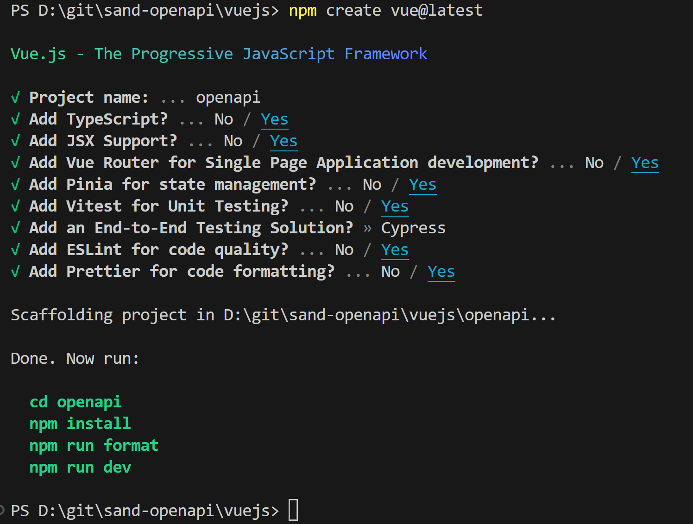
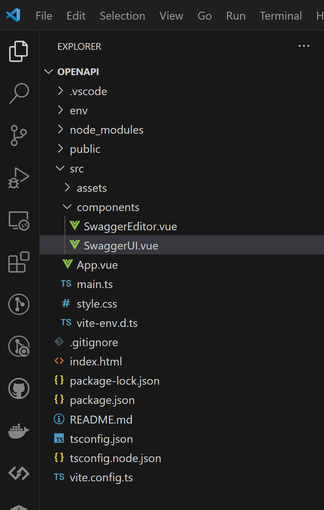
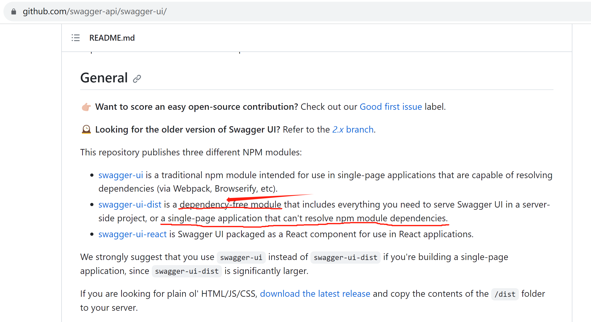
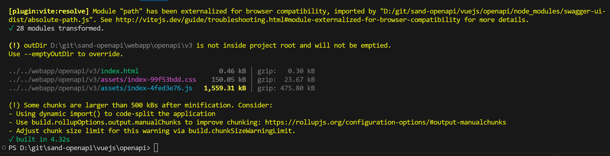
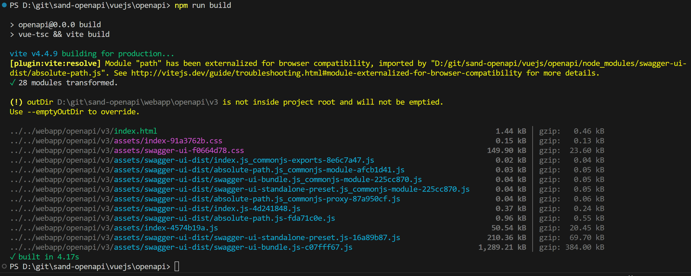
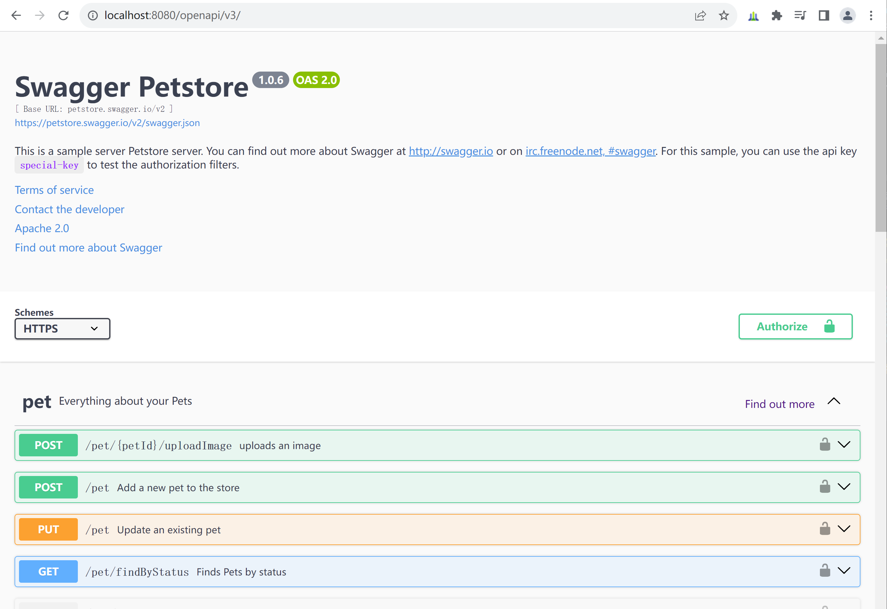

## sand-openapi开发环境搭建笔记

### idea community开发本项目框架
推荐使用idea community来开发sand-openapi模块。步骤如下：
1. 下载和安装idea community
2. 在idea中，从github检出[ofbiz-framework](https://github.com/apache/ofbiz-framework)、[sand-openapi](https://github.com/langhua/sand-openapi)到本地，比如

    1. Windows下：

   ```shell
   D:\git\ofbiz-framework
   D:\git\sand-openapi
   D:\git\ofbiz-plugins
   ```

    2. Linux下：

   ```shell
   ~/git/ofbiz-framework
   ~/git/sand-openapi
   ~/git/ofbiz-plugins
   ```

   说明：[ofbiz-plugins](https://github.com/apache/ofbiz-plugins)选装。


3. 在把sand-openapi目录链接为ofbiz-framework/plugins/sand-openapi
    1. Windows中，以系统管理员身份运行命令行终端：

   ```shell
   C:\Windows\System32>D:
   D:\>cd git\ofbiz-framework
   D:\git\ofbiz-framework>mklink /D plugins ..\ofbiz-plugins
   D:\git\ofbiz-framework>cd plugins
   D:\git\ofbiz-framework\plugins>mklink /D sand-openapi ..\..\sand-openapi
   ```

    2. Linux下：

   ```shell
   ~$cd ~/git/ofbiz-framework
   ~/git/ofbiz-framework$ln -s ../ofbiz-plugins plugins
   ~/git/ofbiz-framework$cd plugins
   ~/git/ofbiz-framework/plugins$ln -s ../../sand-openapi sand-openapi
   ```

### VSCode开发vuejs子项目
即在idea的java项目中，套了一个vscode来开发vuejs子项目。步骤如下：

1. 下载并安装[VSCode](https://code.visualstudio.com/download))]

2. 在VSCode中，新建vuejs目录，在vuejs目录下，通过vue创建openapi项目：

   ```shell
   cd vuejs
   npm create vue@latest
   ```
   运行结果如下图所示：

   

3. 按照上面提示的命令，完成openapi项目初始化，并启动：
   ```shell
   cd openapi
   npm install
   npm run format
   npm run dev
   ```

4. 在浏览器中打开http://localhost:5173/，验证页面访问正常。

5. 编辑vuejs/openapi/src/vite.config.js：
   ```javascript
   import { fileURLToPath, URL } from 'node:url'
   
   import { defineConfig } from 'vite'
   import vue from '@vitejs/plugin-vue'
   import vueJsx from '@vitejs/plugin-vue-jsx'
   
   // https://vitejs.dev/config/
   export default defineConfig({
   plugins: [
     vue(),
     vueJsx(),
   ],
   resolve: {
     alias: {
       '@': fileURLToPath(new URL('./src', import.meta.url))
     },
     preserveSymlinks: true
   },
   base: './',
   build: {
     outDir: '../../webapp/openapi/v3',
   },
   envDir: './env'
   })
   ```

6. 上面的文件会报错，安装@vitejs/plugin-vue-jsx和@types/node来消除错误：
   ```shell
   npm install -D @vitejs/plugin-vue-jsx
   npm install -D @types/node
   ```
   
### vite+vue3+swagger-ui
说明：开发和调试vue3代码，是在vscode中，打开vuejs/openapi目录，如下图所示：



本小节内容均是在vuejs/openapi目录下进行。

1. 按照[swagger-ui](https://github.com/swagger-api/swagger-ui/)的README.md中的说明，swagger-ui-dist适合单页应用开发，正符合在本模块vue3里调用，所以安装swagger-ui-dist和@types/swagger-ui-dist两个：

   

   ```shell
   npm i -D swagger-ui-dist 
   npm i -D @types/swagger-ui-dist
   ```

2. 新建src/components/SwaggerUI.vue，把swagger-ui-dist/index.html转写为vue3：
   node_modules/swagger-ui-dist/index.html:
   ```html
   <!-- HTML for static distribution bundle build -->
   <!DOCTYPE html>
   <html lang="en">
     <head>
       <meta charset="UTF-8">
       <title>Swagger UI</title>
       <link rel="stylesheet" type="text/css" href="./swagger-ui.css" />
       <link rel="stylesheet" type="text/css" href="index.css" />
       <link rel="icon" type="image/png" href="./favicon-32x32.png" sizes="32x32" />
       <link rel="icon" type="image/png" href="./favicon-16x16.png" sizes="16x16" />
     </head>
   
     <body>
       <div id="swagger-ui"></div>
       <script src="./swagger-ui-bundle.js" charset="UTF-8"> </script>
       <script src="./swagger-ui-standalone-preset.js" charset="UTF-8"> </script>
       <script src="./swagger-initializer.js" charset="UTF-8"> </script>
     </body>
   </html>
   ```
   
   src/components/SwaggerUI.vue:
   ```vue
   <template>
       <div id="swagger-ui"></div>
   </template>
   
   <script lang="ts">
   import 'swagger-ui-dist/swagger-ui.css'
   import 'swagger-ui-dist/index.css'
   import { SwaggerUIBundle, SwaggerUIStandalonePreset } from 'swagger-ui-dist'
   
   export default {
       mounted() {
           SwaggerUIBundle({
               // 或者使用yaml样例文件: "https://petstore.swagger.io/v2/swagger.yaml"
               url: "https://petstore.swagger.io/v2/swagger.json",
               dom_id: '#swagger-ui',
               deepLinking: true,
               presets: [
                   SwaggerUIBundle.presets.apis,
                   SwaggerUIStandalonePreset
               ],
               plugins: [
                   SwaggerUIBundle.plugins.DownloadUrl
               ],
               // 如果使用StandaloneLayout，会显示swagger-ui自带的页眉和页脚
               // layout: "StandaloneLayout"
           })
       }
   }
   </script>
   ```

3. 编译到webapp/openapi/v3/目录下：
   1. 配置vite.config.ts：
   ```typescript
   import { fileURLToPath, URL } from 'node:url'
   import { defineConfig } from 'vite'
   import vue from '@vitejs/plugin-vue'
   import vueJsx from '@vitejs/plugin-vue-jsx'

   // https://vitejs.dev/config/
   export default defineConfig({
       plugins: [
           vue(),
           vueJsx()
       ],
       resolve: {
           alias: {
               '@': fileURLToPath(new URL('./src', import.meta.url))
           },
           preserveSymlinks: true
       },
       base: './',
       build: {
           outDir: '../../webapp/openapi/v3',
       },
       envDir: './env',
   })
   ```
   
   2. 执行编译命令：
   ```shell
   npm run build
   ```
   编译命令执行情况如下图所示：

   

   3. 根据上图提示，在vite.config.ts中加入chunk配置：
   ```typescript
   ...
   build: {
       outDir: '../../webapp/openapi/v3',
       chunkSizeWarningLimit: 1500, // 文件大小超过1500kb时显示警告提示
       rollupOptions: {
           output: {
               manualChunks(id: any): string {
                   if (id.includes("swagger-ui-dist")) {
                       return "swagger-ui-dist" + id.toString().split("swagger-ui-dist")[1]
                   }
               }
           }
       }
   },
   ...
   ```
   
   4. 再次执行编译命令，结果如下图所示：

   

   5. 启动OFBiz，在浏览器中访问：http://localhost:8080/openapi/v3/ ，如下图所示：
   
   