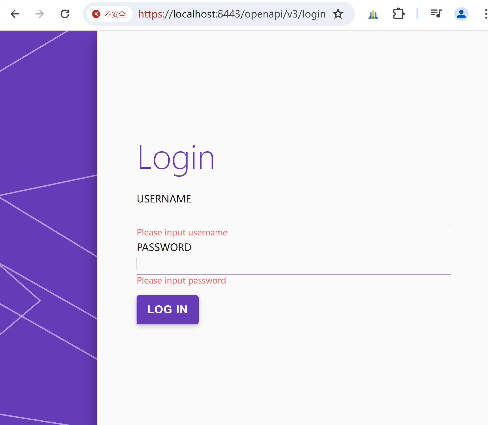
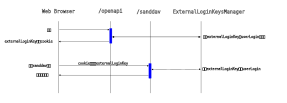

# 登录

登录功能，是为了用户访问sanddav文件管理功能而设计的。实现上分前端和后端两部分。

## 前端实现笔记

前端实现使用Vue.js框架，使用Vue.js的router功能实现页面跳转，使用Vue.js的axios功能实现与后端的交互。

### 选择登录页面

受[vue 3 项目实战一（绘制登录界面）](https://blog.csdn.net/qq_41045128/article/details/125651144)这篇文章的启发，在codepen.io上搜索login，挑选了[Melanie E Magdalena设计的登录页面Dynamic Single Page Login + Sign Up](https://codepen.io/m2creates/pen/EEvGgW)。

页面设计如下图所示：



下载登录页面设计，如下图所示：


将下载的zip文件解压缩后，在dist目录下有3个文件：index.html、script.js、style.css。浏览三个文件的内容，发现index.html是单页html代码，script.js是通用的javascript文件，style.css是标准的css样式文件。

<br/>

### 修改登录页面，以支持Vue 3

分析index.html文件，发现index.html文件最后几行是：

```html
<!-- partial -->
<script src='https://cdnjs.cloudflare.com/ajax/libs/jquery/3.3.1/jquery.js'></script>
<script src='https://cdnjs.cloudflare.com/ajax/libs/paper.js/0.11.3/paper-full.min.js'></script>
<script  src="./script.js"></script>

</body>
</html>
```

这种写法，意味着script.js的代码，对应于Vue3 typescript的mounted阶段执行，因此，LoginView.vue的代码结构如下：
```vue3
<template>
<!-- dist/index.html的body内的代码 -->
...
</template>
<script lang="ts">
import '@/assets/login/login.css'
import $ from 'jquery'
import paper from 'paper'
import { Group, Path, Point } from 'paper'
export default {
  mounted() {
    // 按照typescript改写的script.js的内容
    ...
  }
}
</script>
```

几个改写需要注意的地方：
1. 安装和导入jquery，以便使用jquery的$符号：
```shell
yarn add jquery
```

2. 安装和导入paper.js，以便使用paper.js的Path、Group、Point等符号：
```shell
yarn add paper
```

3. 对$(document)的改写：

```javascript
$(document).ready(function(){
改写为：
$(function(){
```

4. 注释掉paper.install(window)，因为只有在javascript里，才需要这样初始化，在typescript里，不需要这样做的。

<br/>

### 添加登录表单

详见[基于el-form表单实现登录表单](el-form.md)

<br/>

## 后端实现笔记

登录和认证的后端实现，是基于cookie实现的。认证流程如下图所示：



登录流程：
1. 用户在浏览器上输入用户名和密码，提交到后端/openapi/control/cookieAuthn。
2. cookieAuthn里，调用LoginWorker.login(request, response)进行登录。
3. 如果登录成功，调用ExternalLoginKeysManager.getExternalLoginKey(request)方法，建立externalLoginKey与登录用户的对应关系。
4. 在response里，设置externalLoginKey的cookie。
5. 浏览器保存cookie。

访问sanddav文件流程：
1. 用户在浏览器中访问sanddav文件，浏览器会把cookie中的externalLoginKey发送给后端。
2. 通过OFBizAuthnFilter过滤器，过滤出externalLoginKey。
3. 通过ExternalLoginKeysManager.checkExternalLoginKey(request, response)方法，得到登录用户。
4. 返回sanddav文件。

<br>

### 参考资料
1. [vue 3 项目实战一（绘制登录界面）](https://blog.csdn.net/qq_41045128/article/details/125651144)
2. [Melanie E Magdalena设计的登录页面Dynamic Single Page Login + Sign Up](https://codepen.io/m2creates/pen/EEvGgW)
3. [前端异步校验程序](https://github.com/yiminghe/async-validator)
4. [Swagger支持的认证模式](https://swagger.io/docs/specification/authentication/)
