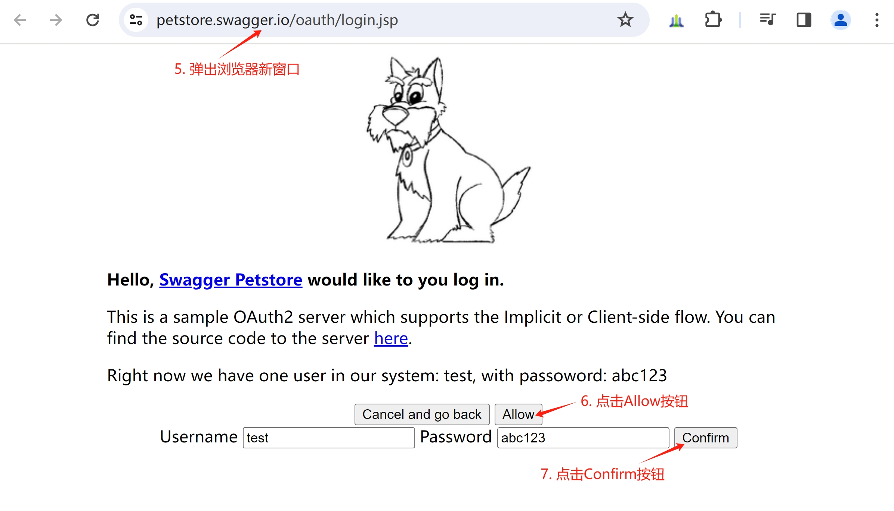

# 实现OAuth 2.0认证

OAuth 2.0认证，对应OpenAPI文档中的[OAuth 2.0](https://swagger.io/docs/specification/authentication/oauth2/)。

### 前端使用pestore oauth2

[petstore-openapi-v3.yaml](../../config/petstore-openapi-v3.yaml)中定义了OAuth 2.0认证：

```yaml
components:
  securitySchemes:
    petstore_auth:
      type: oauth2
      flows:
        implicit:
          authorizationUrl: 'https://petstore.swagger.io/oauth/authorize'
          scopes:
            'write:pets': modify pets in your account
            'read:pets': read your pets
```

1. Swagger-UI和Swagger-Editor的oauth2缺省返回地址是/oauth2-redirect.html，因此把vuejs/openapi/node_modules/swagger-ui-dist/oauth2-redirect.html复制到vuejs/openapi/目录下。

2. 进入vuejs/openapi/目录，启动vite-vue3：
    ```bash
    cd vuejs/openapi/
    npm run dev  
    ```

3. 在浏览器中访问http://localhost:5173/editor?fileUri=/petstore/api/v3/openapi.yaml，点击"Authorize"（认证）按钮，会弹出认证浮窗：

   

<br/>

4. 在认证浮窗中，CLIENT_ID（客户ID）输入test，然后点击"Authorize"（认证）按钮，如下图所示：

   

<br/>

5. 浏览器会弹出新窗口，点击"Allow"（允许）按钮，会出现已经填好的用户名和密码行，点击"Confirm"（确认）按钮，如下图所示：

   

<br/>

6. 窗口会跳转到授权页面，点击"Authorize"（授权）按钮，如下图所示：

   

<br/>

7. 窗口会自动关闭，之前的认证浮窗会显示"Authorized"（已授权）字样，以及"Logout"（注销）按钮，点击"Close"（关闭）按钮，如下图所示：

   

<br/>

8. 认证浮窗关闭，编辑器页面上的表示认证状态的锁，会从打开状态，变为关闭状态，如下图所示：

   

<br/>

至此，完成petstore_auth的oauth2认证。

**【注意】** swagger-petstore的后端接口，仅用于演示目的，没有使用OAuth2认证和鉴权，不能直接用于实际项目。

<br>

### 通过OFBiz-CAS模块，完整实现OAuth2认证和鉴权

使用OFBiz-CAS模块，完整实现swagger-petstore，参见[支持Swagger OAuth2认证流程](https://github.com/langhua/OFBiz-CAS/blob/ofbiz-22.01-cas-5.3.15.1-r1/docs/cas-5.3.15.1-swagger-oauth-zh.md)

<br/>

### 参考文档
1. [OAuth 2.0](https://swagger.io/docs/specification/authentication/oauth2/)
