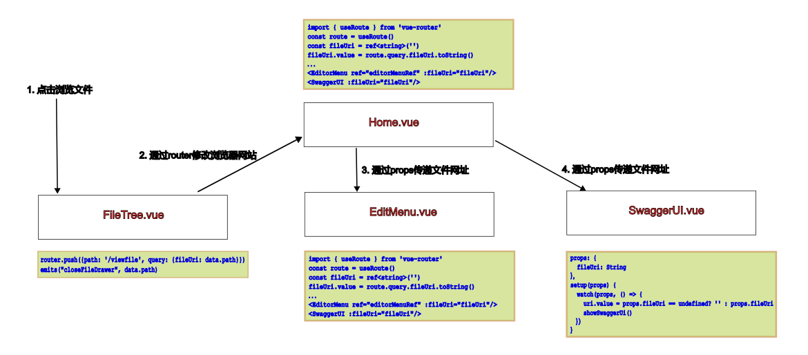

# 功能操作按钮

### 文件/文件夹功能

文件夹功能包括：新建文件、新建文件夹、剪切、复制、粘贴、重命名、删除、刷新、移动。如下图所示；


<br/><br/>

文件功能包括：编辑、剪切、复制、粘贴、删除、重命名、历史记录、移动。如下图所示：


<br/>

按钮的图标，是扩展了el-icon，增加图标的步骤，详见[扩展@element-plus/icon-vue图标](./el-icon-ext.md)。

部分图标的功能，调用了后端的webdav接口，如新建文件夹等。

### 前端功能：浏览文件

以文件按钮为例，说明如何实现vue3的数据流（页面跳转和在主页面-子页面间参数传递），数据流如下图所示：



<br/>

### 后端功能：新建文件夹

新建文件夹的逻辑，是前端输入文件夹名称，点击新建按钮，发送webdav mkcol请求给后端，后端新建文件夹，并返回是否新建成功。如果成功，则前端刷新页面，显示新建的文件夹。


前端核心代码如下：
```typescript
const newFolder = ()  => {
  newFolderDialogVisible.value = false
  setTimeout(async () => {
    await axios({method: 'mkcol',
                 url: parentNodeForEdit.value?.data.path + input.value,
                })
                .then(response => {
                      if (response.status == 201) {
                        let tempPath = parentNodeForEdit.value?.data.path.slice(1)
                        tempPath = tempPath.slice(tempPath.indexOf('/'))
                        ElMessage({
                                    type: 'success',
                                    message: tempPath + input.value + ' has been created successfully.',
                                  })

                        if (parentNodeForEdit && parentNodeForEdit.value) {
                          parentNodeForEdit.value.loaded = false
                          parentNodeForEdit.value.expand()
                        }
                      }
                  })
  }, 500)
}
```

<br/>

后端的webdav功能，直接使用tomcat的webdav实现即可，详见[WebDAV规范文档](https://fullstackplayer.github.io/WebDAV-RFC4918-CN/09-WebDAV%E7%9A%84HTTP%E6%96%B9%E6%B3%95.html)。

<br/>

### 参考资料
1. [WebDAV规范文档](https://fullstackplayer.github.io/WebDAV-RFC4918-CN/09-WebDAV%E7%9A%84HTTP%E6%96%B9%E6%B3%95.html)
