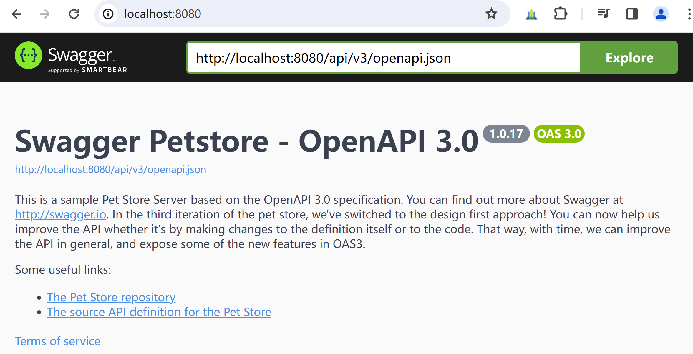
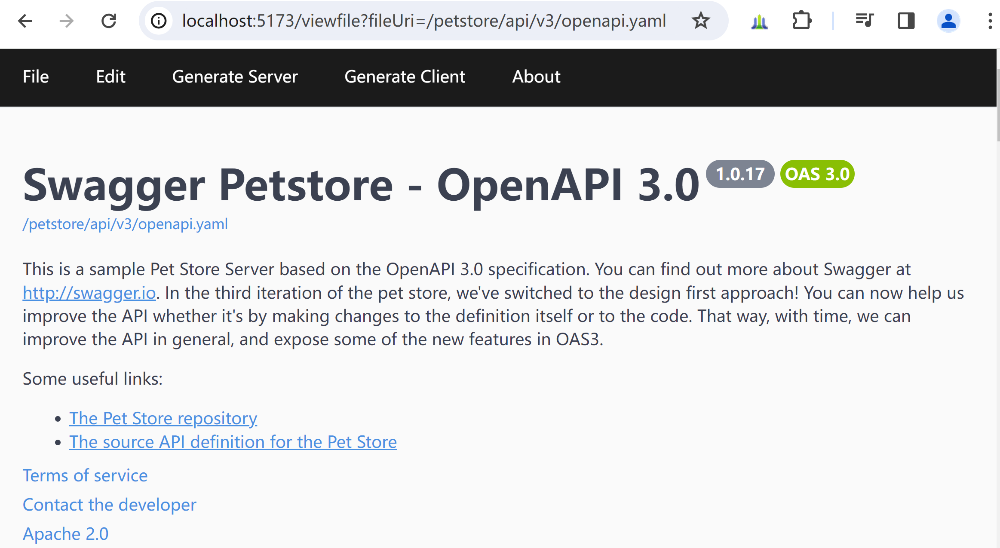

# 运行swagger-petstore样例

[swagger-petstore](https://github.com/swagger-api/swagger-petstore)是swagger官方提供的样例，展示了openapi完整的功能。

这里使用的是swagger-petstore的master版本。

### 运行swagger-petstore
1. 下载swagger-petstore
2. 运行swagger-petstore：
    ```shell
    mvn clean package jetty:run
    ```
3. 在浏览器中访问[http://localhost:8080](http://localhost:8080)，如下图所示：

   

### 部署到sand-openapi模块中
1. 在sand-openapi/build.gradle中，添加依赖运行swagger-petstore所需的依赖：
   ```groovy
   pluginLibsCompile 'io.swagger.core.v3:swagger-jaxrs2-servlet-initializer:2.2.6',
            'io.swagger:swagger-inflector:2.0.5'
   ```
2. 将swagger-petstore项目src/main/java/下的代码，复制到sand-openapi/src/main/java/目录下
3. 将swagger-petstore项目根目录下的inflector.yaml，复制到sand-openapi/config/中，并修改swaggerUrl和rootPath，如下所示：
   ```yaml
   ...
   swaggerUrl: petstore-openapi-v3.yaml
   ...
   rootPath: /petstore/api
   ```
4. 将swagger-petstore项目src/main/resources/openapi.yaml，复制为sand-openapi/config/petstore-openapi-v3.yaml，修改servers url设置如下：
   ```yaml
   servers:
     - url: /petstore/api/v3
   ```
5. 编辑sand-openapi/webapp/petstore/WEB-INF/web.xml文件，添加swagger-petstore项目src/main/webapp/WEB-INF/web.xml的内容：
   ```xml
       <servlet>
           <servlet-name>swagger-inflector</servlet-name>
           <servlet-class>org.glassfish.jersey.servlet.ServletContainer</servlet-class>
           <init-param>
               <param-name>javax.ws.rs.Application</param-name>
               <param-value>io.swagger.oas.inflector.OpenAPIInflector</param-value>
           </init-param>
           <init-param>
               <param-name>jersey.config.server.provider.packages</param-name>
               <param-value>
                   com.fasterxml.jackson.jaxrs.yaml.JacksonYAMLProvider
               </param-value>
           </init-param>
           <load-on-startup>1</load-on-startup>
       </servlet>
   
       <servlet-mapping>
           <servlet-name>swagger-inflector</servlet-name>
           <url-pattern>/api/*</url-pattern>
       </servlet-mapping>
   
       <filter>
           <filter-name>CORSFilter</filter-name>
           <filter-class>io.swagger.oas.inflector.utils.CORSFilter</filter-class>
       </filter>
       <filter-mapping>
           <filter-name>CORSFilter</filter-name>
           <url-pattern>/*</url-pattern>
       </filter-mapping>
   ```
6. 启动ofbiz
7. 编辑vuejs/openapi/vite.config.js，添加proxy设置：
   ```text
   server: {
       ...
       '/petstore/api': {
         target: 'https://localhost:8443',
         changeOrigin: true,
         secure: false,
       },
     }
   }
   ```

8. 启动vite-vue3
9. 在浏览器中，访问[http://localhost:5173/viewfile?fileUri=/petstore/api/v3/openapi.yaml](http://localhost:5173/viewfile?fileUri=/petstore/api/v3/openapi.yaml)，如下图所示：

   

   可以在swagger-ui中，点击各个接口的“Try it out”按钮，尝试调用接口，验证返回结果。

<br>

### 参考资料
1. [swagger-petstore](https://github.com/swagger-api/swagger-petstore)
