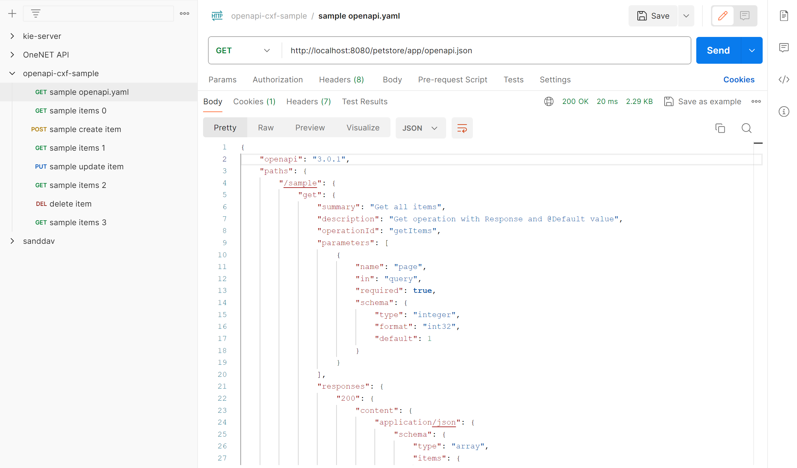
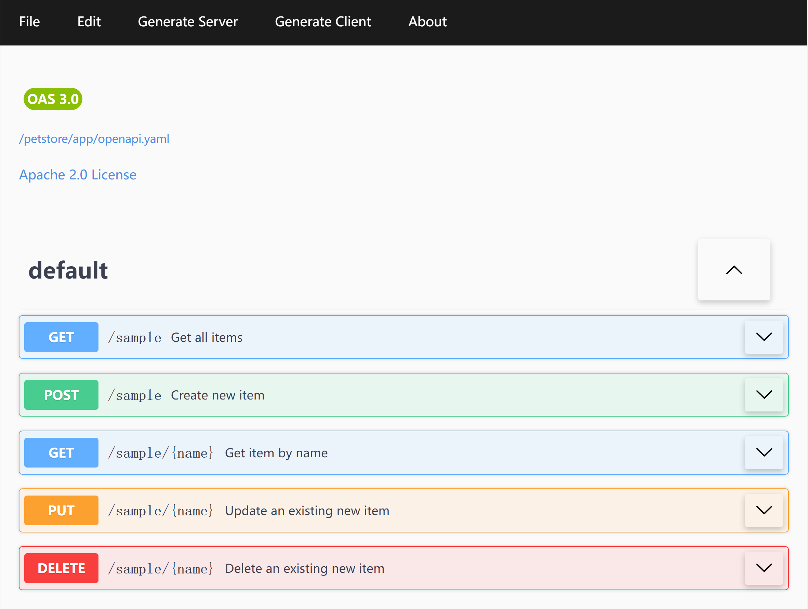

# 运行cxf jax_rs_description_openapi_v3_web样例

与Apache CXF类似的模块，有[OpenLiberty](https://openliberty.io/)。选择Apache CXF的原因是，OFBiz中已经引入了cxf-rt-frontend-jaxrs。

这里使用的CXF版本是3.5.7，Tomcat版本是9.0.75。

### jax_rs_description_openapi_v3_web.war
1. 下载cxf源码
2. 进入distribution/src/main/release/samples/jax_rs/description_openapi_v3_web目录
3. 运行mvn package命令，编译出jax_rs_description_openapi_v3_web.war
4. 将jax_rs_description_openapi_v3_web.war重命名为petstore.war，部署到Tomcat中
5. 修改petstore/WEB-INF/classes/openapi-configuration.json：

   ```text
   "url": "/app",
   ```
   改为：
   ```text
   "url": "/petstore/app",
   ```

6. 重启Tomcat，访问http://localhost:8080/petstore/app/openapi.json，可以看到openapi文档，如下图所示：

   
 
7. 根据上一步得到的openapi文档，访问http://localhost:8080/petstore/app/sample，可以看到返回的json数据
8. 经尝试，WEB-INF/lib/下，与openapi无关的jar可以删除，如glassfish-corba*.jar、pfl-*.jar、geronimo-*.jar等

<br>

### 部署到sand-openapi模块中
在sand-openapi模块中，webapp目录下，新建petstore目录：
1. 在sand-openapi/build.gradle中，添加依赖：
   ```groovy
   pluginLibsCompile 'jakarta.xml.ws:jakarta.xml.ws-api:2.3.3',
            'org.apache.cxf:cxf-rt-rs-service-description-openapi-v3:3.5.7'
   ```

2. 在sand-openapi/src/main/中，添加demo/jaxrs/openapi/server目录，在其中添加[Item.java](https://github.com/apache/cxf/tree/cxf-3.5.7/distribution/src/main/release/samples/jax_rs/description_openapi_v3_web/src/main/java/demo/jaxrs/openapi/server/Item.java)和[Sample.java](https://github.com/apache/cxf/blob/cxf-3.5.7/distribution/src/main/release/samples/jax_rs/description_openapi_v3_web/src/main/java/demo/jaxrs/openapi/server/Sample.java)。
3. 在sand-openapi/config/中，添加openapi-configuration-demo.json文件，内容如下：
   ```json
   {
       "resourcePackages": [
           "demo.jaxrs.openapi.server"
       ],
       "prettyPrint": true,
       "cacheTTL": 0,
       "openAPI": {
           "info": {
               "version": "1.0.0",
               "title": "Sample API",
               "description": "A sample API",
               "contact": {
                   "email": "cxf-dev@apache.org"
               },
               "license": {
                   "name": "Apache 2.0",
                   "url": "http://www.apache.org/licenses/LICENSE-2.0.html"
               }
           },
           "servers": [
               {
               "url": "/petstore/app",
               "description": "The sample API server"
               }
           ]
       },
       "userDefinedOptions": {
           "support.swagger.ui": true
       }
   }
   ```

   注意："url": "/petstore/app"这一行，/app在下面的web.xml的CXFServlet定义。

   <br/>

4. 在sand-openapi/webapp/petstore/WEB-INF/中，新建web.xml文件，内容如下：
   ```xml
   <web-app xmlns:xsi="http://www.w3.org/2001/XMLSchema-instance"
            xmlns="http://java.sun.com/xml/ns/javaee" version="3.0"
            xsi:schemaLocation="http://java.sun.com/xml/ns/javaee http://java.sun.com/xml/ns/javaee/web-app_3_0.xsd">

       <display-name>CXF OpenAPI v3.0 Sample</display-name>
       <servlet>
           <display-name>CXF Servlet</display-name>
           <servlet-name>CXFServlet</servlet-name>
           <servlet-class>org.apache.cxf.jaxrs.servlet.CXFNonSpringJaxrsServlet</servlet-class>
           <init-param>
               <param-name>jaxrs.serviceClasses</param-name>
               <param-value>demo.jaxrs.openapi.server.Sample</param-value>
           </init-param>
           <init-param>
               <param-name>jaxrs.features</param-name>
               <param-value>org.apache.cxf.jaxrs.openapi.OpenApiFeature(openapi-configuration-demo.json)</param-value>
           </init-param>
           <init-param>
               <param-name>jaxrs.providers</param-name>
               <param-value>
                   com.fasterxml.jackson.jaxrs.json.JacksonJsonProvider
               </param-value>
           </init-param>
           <load-on-startup>1</load-on-startup>
       </servlet>
       <servlet-mapping>
           <servlet-name>CXFServlet</servlet-name>
           <url-pattern>/app/*</url-pattern>
       </servlet-mapping>
   </web-app>
   ```
<br>

5. 启动ofbiz
6. 编辑vuejs/openapi/vite.config.js，添加proxy设置：
   ```text
   server: {
     proxy: {
       '/sanddav': {
         target: 'https://localhost:8443',
         changeOrigin: true,
         secure: false,
       },
       '/openapi/control': {
         target: 'https://localhost:8443',
         changeOrigin: true,
         secure: false,
         followRedirects: true,
       },
       '/petstore/app': {
         target: 'https://localhost:8443',
         changeOrigin: true,
         secure: false,
       },
       '/sample': {
         target: 'https://localhost:8443/petstore/app',
         changeOrigin: true,
         secure: false,
       },
     }
   }
   ```
      
7. 启动vite-vue3
8. 在浏览器中，访问http://localhost:5173/viewfile?fileUri=/petstore/app/openapi.yaml，如下图所示：

   

   可以在swagger-ui中，点击各个接口的“Try it out”按钮，尝试调用接口，验证返回结果。
<br>


### 参考资料
1. [在Tomcat中配置swagger和cxf](https://cwiki.apache.org/confluence/display/CXF20DOC/OpenApiFeature)

