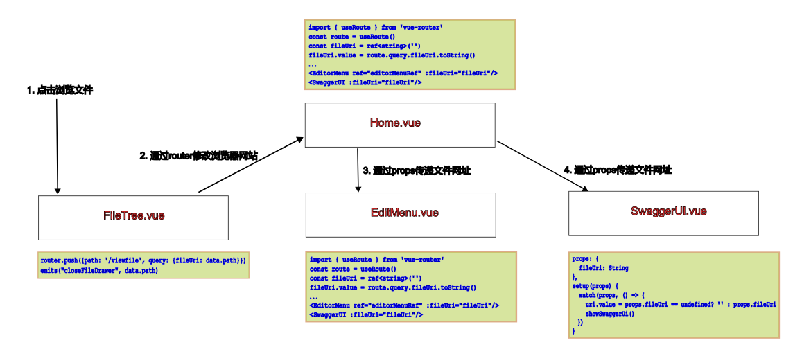

# Vue3数据流

### FileTree选中文件，在SwaggerUI中打开浏览
以文件按钮为例，说明如何实现vue3的数据流（页面跳转和在主页面-子页面间参数传递），数据流如下图所示：

  

### 参考资料
1. [Vue Router](https://router.vuejs.org/zh/guide/)
2. [Props](https://cn.vuejs.org/guide/components/props)
3. [组件事件](https://cn.vuejs.org/guide/components/events.html)